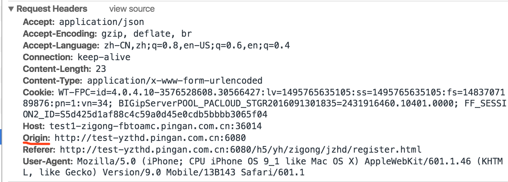
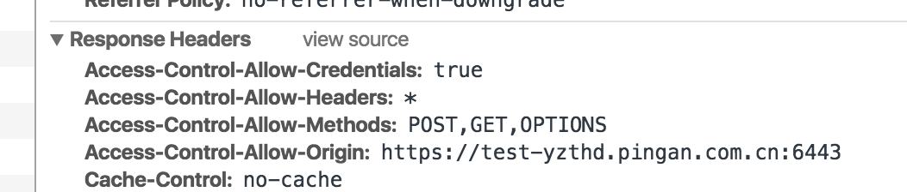

# 解决浏览器跨域问题

> 目前两种方式 `CORS` 和 `JSONP`
>
> - CORS支持所有类型的HTTP请求
> - JSONP只支持`GET`请求，但支持老式浏览器


### CORS通信

#### 简单请求

浏览器检测到请求跨域会自动使用cors通信



1. 首先会在`request header`添加`origin`字段，来说明请求来自哪里。
2. 然后服务器根据这个值判断是否同意这次请求
3. 服务器返回
   1. 同意请求，会在`response header`添加`Access-Control-Allow-Origin`字段，**指定的域名**或`*`
   2. 拒绝请求，返回正常的HTTP响应，浏览器判断没有`Access-Control-Allow-Origin`报错，错误不能通过状态码捕获。



【注】

1. `Access-Control-Allow-Origin`:`*`无法返回`cookie`，必须要指定一个域名。
2. 同时如果需要返回cookie`AJAX`请求必须带有`withCredentials`:`true`

```javascript
{
  url: url,
  type: 'post',
  dataType: 'json',
  contentType: 'application/x-www-form-urlencoded',
  cache: true,
  data: {
    publicKeyType: 99,
    skip: 1
  },
  xhrFields: {
    withCredentials: true
  },
  crossDomain: true,
}
```

#### 复杂请求

`PUT`,`DELETE`或者`Content-Type`:`application/json`

1. 正式通信之前，增加一次`HTTP`请求——“预检”(preflight)
2. Browser询问Service，网页的域名是否在许可名单上。

------


### JSONP

> 所有带有src属性的都不受同源策略限制

```html
<script src="www.api.com/test?id=xxx&callback=jsonpCallback"></script>
```

接口返回 'jsonpCallback({test:1})'

页面会有一个 jsonpCallback方法，在接口返回的时候实际上就调用了jsonpCallback方法，执行了回调。


